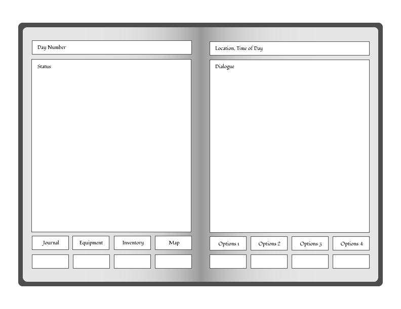

# **Path of Mice**
*An Interactive Fantasy Adventure* 
by Daryl Gray 
Version 0.1 (Beta)

### Introduction
*Path of Mice* is an **IFRPG** (Interactive Fantasy Role-Playing Game) built using **HTML5**, **CSS** and **JavaScript**. Designed like a **CYOA** (choose your own adventure), *Path of Mice* allows the player to forge their own path as a mouse in a world teeming with mystery and danger.

The game is played by reading an interactive story while choosing commands when prompted. These commands are displayed either through the dialogue or in the choice menu. ~~There is a list of available commands at the start of the game and this list can be accessed at any given time by typing help.~~

### Story
The story takes place in the forest of Briarwood as you, a mouse on a path anew, embark on a grand adventure. Your choices progresses the story as you explore the mysterious and dangerous forest of Briarwood.

As the lead in your story, every choice you make is added to your <i>**Journal**</i>. This book can be used to review various topics like **Stats**, **Abilities**, **Quests**, **Creatures** and more.

### Mechanics
In the game, the player clicks links within the **Dialogue** or **Adventure Menu** to progress the adventure. Common choices include *directional commands* like **Go North** or **Climb Ladder** depending on the room or area; while other choices will appear when available like **Explore** or  **Rest**.

Some in-game actions can create dialogue that can help or harm the player. For example, having the item **Torch** or **Lantern** in your inventory will automatically illuminate a dark room adding extra dialogue and visual clues.

##### Game Design
*Path of Mice* is designed for PC and Mobile using HTML5, CSS and JavaScript. The game is designed like an animated book that page turns during the adventure. The idea is that the game is a live recording your adventures and is based off the book series <i>**Tristan's Travels**</i>. The series is about a happy traveling mouse from the forest of Briarwood and acts as a world building window.

 
The game begins with a closed book that opens to the Title Page.

##### Menu Mechanics
The **Menu Display** is an options menu that displays various options like **Journal**, **Equipment**, **Inventory**, **Map** and more. When selecting any of these options the **Status** display will be replaced by the selected option.

| Options | Description |
| --- | --- |
| Journal | Reviews various notes including Stats, Abilities, Skills, Quest, NPCs, Monsters, Locations and more. |
| Apparel | Change out weapons, armors and accessories.|
| Backpack | Display and Organize stashed items and finds from your satchel. |
| Map | View past visited towns and dungeons. Fast travel to certain places. |

##### Talk Mechanics
Every interaction with an **NPC** in Path of Mice triggers a **Talk Menu** whether friend or foe. This menu replaces the **Adventure Menu** by displaying new choices upon meeting an creature. Talking with the many creatures of the forest can help further your adventure, start a questline, learn a kept secret and more. Common Talk commands include:

| Options | Description |
| --- | --- |
| Chat | Begin a conversation with the NPC. |
| Wave | Give a friendly gesture.
| Examine | Examine the NPC with a more accurate description.
| Leave | Return to the adventure. |

*Note* - Some NPCs have special option choices that can trigger depending on numerous factors such as carrying an certain item, the time of day, in-game progress or more.

##### Shop Mechanics
*Shops*, *Vendors* and *Merchants* within the forest of Briarwood all share a similar **Shop Menu** that displays common shopping commands like:

| Options | Description |
| --- | --- |
| Buy | Purchase items for sale from the Shopkeeper. |
| Sell | Part with various goods for extra gold. |
| Trade | Trade rare and valuable items for rare finds. |
| Leave | Exit the shop. |

The **Shop Menu** will display different options whether visiting an **Inn**, **Smithy**, **Pharmacy** or other place of business. Examples include:

| Options | Description |
| --- | --- |
| Stay | Spend some time resting in a safer area. |
| Cook | Cook delicious delicacies from monster parts. |
| Brew | Blend liquids to create empowering drinks. |
| Forge | Build weapons and armors from collected materials. |
| Tailor | Make fashionable garbs by stitching materials. |
| Concoct | Craft potions and cures from gathered materials. |

*Note* - Every village varies in available shops and stores. Some shops are hidden along the trails of the forest.

##### Battle Mechanics
Path of Mice features a turn-based battle system that is triggered when encountering an enemy or boss. When a battle begins the **Adventure Menu** is replaced with **Battle Menu**. Common Battle commands displayed include:

| Options | Description |
| --- | --- |
| Attack | Attack the enemy with a chance of inflicting damage.
| Defend | Guard against the next incoming attack.
| Evade | Attempt to avoid the next incoming attack.
| Skill | Choose from a list of learned skills.
| Item | Use an item from your inventory.
| Wait | Forfeit your turn. Helps recover *Stamina*.
| Flee | Attempt to escape the battle.
| Yield | Surrender the battle to the enemy.

*Note* - Some battles are inescapable. Yielding can sometimes work in the player's favor as some enemies are less-likely to harm you.
